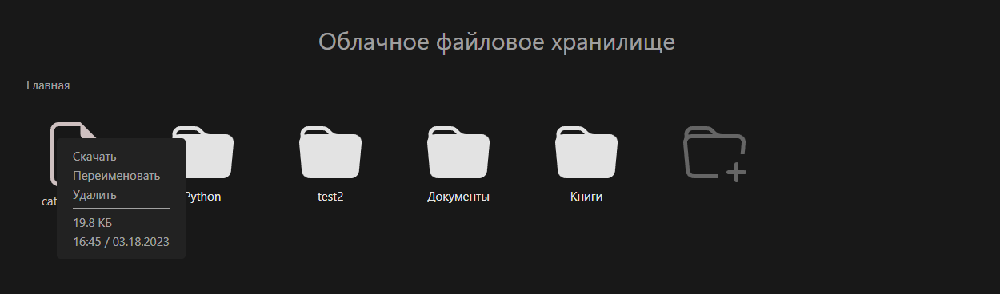
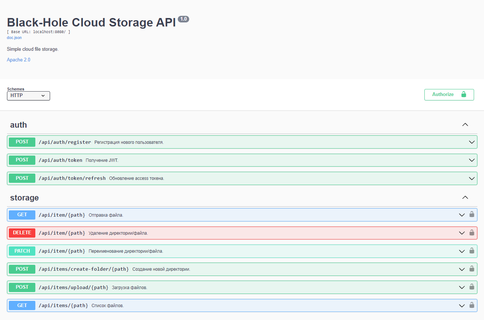

<h1 align="center">Black Hole Cloud Storage</h1>

<p align="center">

</p>

---

### Используемые языки и фреймворки:

<div>


</div>

### Используемые технологии:

<div>


</div>

---

Облачное файловое хранилище с поддержкой drag&drop

* Frontend - Vue.js
* Backend - Go
* Database - MySQL




## Конфигурация

Для настроки подключения к базе данных MySQL используются следующие переменные окружения

```
DB_HOST=127.0.0.1
DB_PORT=3306
DB_NAME=black_hole
DB_USER=user
DB_PASS=password
```

Изменение секретного ключа для генерации JWT

```
SECRET_KEY=my-secret-key
```

В данный момент все файлы пользователей хранятся в локальной директории, 
указанной в переменной окружения

```
STORAGE_DIR=storage
```

Иерархия файлового хранилища:

* storage/
  * <user-id>/
    * <files...>
  * <user-id>/
    * <files...>

## Запуск

Для запуска через docker используем команду

```shell
docker compose up -d
```

Так как пользовательские данные хранятся локально, то при работе backend приложения в
контейнере необходим **bind mount** директории в которой будут храниться файлы в контейнер.

Если переменная окружения `STORAGE_DIR=storage`, то в контейнере это папка
`/app/storage` - это и будет корневая директория хранилища.


### Создание исполняемого файла backend приложения:

```shell
go mod download
go build -v web/backend/cmd/app
```
или
```shell
go mod download
make
```

## Документация

Swagger документация доступна по URL `/api/swagger/index.html`

